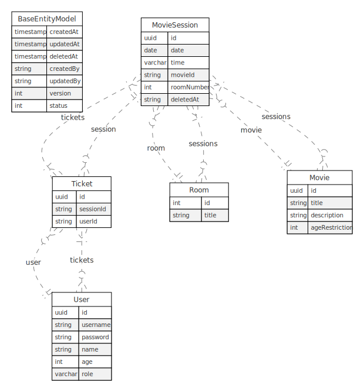

### Approach
I aimed to create a scalable, modular, readable, consistent, and well-documented project that adheres to DDD principles. Additionally, I focused on building an API that is easily traceable, monitorable, and extendable. The use-case approach facilitates collaboration within large teams; however, to keep the project manageable, I kept the repository classes module-based. I strived to leverage TypeORM's features (such as relationships and CRUD functions) effectively. I ensured that each functionality (guards, interceptors, etc.) was implemented in the right place using the appropriate method. I also prioritized avoiding duplicate code throughout the project.
### Challanges
Overall, I did not face significant technical difficulties during the project. However, I occasionally encountered challenges in determining how to structure the overall modular architecture to meet all the requirements within the given timeframe. Additionally, I found it challenging to define value objects appropriately.
### Decisions
- To avoid extending the project timeline, I adhered strictly to the requirements.
- It was assumed that a user with the manager role already exists.
- For movie sessions:
  - It was assumed that room entries (e.g., room numbers 1, 2, and 3) already exist in the database.
  - RA seat structure was not implemented alongside rooms.
  - No development was made to dynamically check available movies based on the current date; only the session's active status was validated.
- Soft delete was preferred for data deletion.
- Watching a movie was interpreted as using a valid ticket.
- Request and response processing relied entirely on validation mechanisms.
- Since NestJS's HTTP exception handling is robust, no additional customizations were made beyond adding logs. (Errors with a 500 status code should ideally be integrated into an alert-based system.)
- Git related configurations weren't made for remote like protecting main branch etc.
### Project Technical Features:
1. **Access-Refresh Token Authentication**: 
    - Implemented `nextjs/password` for access and refresh token strategies.
    - Applied a global `AtGuard` for authentication.
1. **CorrelationId and Custom Logger Service**:
    - Used CorrelationId middleware and implemented `nest-winston` LoggerService.
    - Integrated `AsyncLocalStorage` for managing request contexts
1. **Error Handling**: Exception logging was achieved using a custom Exception Filter.
1. **Manager and Customer Roles**: Role-based access control implemented using a Role Guard
1. **Interceptors**:
    - PasswordHash: Replaces the password in the request body with its hashed equivalent.
    - AddUserIdIntoBody: Automatically adds the userId from the token payload to the request body.
1. **Decorators**:
    - CheckRole: Combines role checks with the RoleGuard.
    - GetCurrentUserId: Retrieves userId injected into the request from the token payload.
    - Public: Bypasses the `AtGuard` for specified routes.
1. **Throttle**: Applied a global rate limiter for the API.
1. **Domain Driven Design**: Attempted to follow Domain-Driven Design principles with a use-case-based structure.
1. **TypeORM**: Implemented TypeORM for database interactions.
1. **Request ve Response validation**: Used DTOs and Validation Pipes, incorporating ClassTransformer for serialization.
1. **Bulk Movie Adding**: Implemented a feature for adding multiple movies at once.
1. **Modularity**: Followed the controller-service-repository pattern for clear separation of concerns.
1. **Swagger**: Provided detailed API documentation accessible via the /api-docs endpoint.
1. **E2E Test**: Separated test environments to facilitate seamless execution of end-to-end tests.
1. **Well-designed API**: Emphasized a consistent, intuitive, and Restful API design.
1. **Husky, eslint, prettier**: Integrated tools for commit message checking and linting.
1. **Github Workflow**: Automated deployment and E2E testing via GitHub workflows.
> **NOTE:**  The .env files included in the repository are provided as examples. Their contents may need to be modified depending on whether the project is run locally or in a Docker environment.

> **NOTE:**  If you want to run a service using the docker compose command and the compose file contains environment variables to use in it, the command should be executed with the --env-file <env_file> argument.
### Deliberate Design Decisions:
1. **Cascade Usage in Movie POST Endpoint**: Cascade kullanımını göstermek için `POST /api/movies/*` endpointlerinde filmler ile beraber direkt olarak sessionları da alındı.
2. **Extended Access Token Expiry for Testing:**: To facilitate API testing without frequently refreshing tokens, the access token expiration time was set to 1 year in the `.env` file.
3. **Simple CRUD Operations:**: Operations involving basic CRUD functionality were implemented directly within their respective individual service files.
4. **Session Handling for Available Movies and Watching:** Since no specific requirements were provided for listing available movies or watching movies, sessions were not invalidated based on dates. Instead, only a session modify/delete endpoint was implemented to manage sessions.
5. **No Seat Assignment for Ticket Purchases**: To keep the project scope manageable, seat assignments were not added to the ticket purchase functionality.

### Advanced Improvements to Consider:
1. **Storing and Managing Refresh Tokens:** Refresh tokens should be stored and managed using a system like Redis or a similar technology to enhance control and security.
1. **Enhanced Repository Management:** Repositories should be structured around use cases and managed more effectively using repository interfaces.
1. **Idempotency Middleware Implementation:** An idempotency middleware should be implemented to ensure duplicate requests do not cause unintended side effects.
1. **Event Sourcing and CQRS:** Separate repositories into read and write operations to facilitate Event Sourcing and implement the CQRS pattern.
1. **Improved Swagger Documentation:** Use grouped ApiResponse decorators in Swagger documentation, incorporating variables for consistent usage across operations.
1. **Log Management:** Implement a logging system using ELK stack or a similar solution for centralized log management and monitoring.
___
### Project Directory Structure
<pre>
.
|-- src
|   |-- @globals
|   |   `-- express
|   |-- application
|   |   |-- dtos
|   |   |   `-- response
|   |   `-- use-cases
|   |-- domain
|   |   |-- entities
|   |   |-- mappers
|   |   |-- repositories
|   |   |-- services
|   |   `-- value-objects
|   |-- hello
|   |-- infrastructure
|   |   |-- auth
|   |   |   |-- guards
|   |   |   `-- strategies
|   |   |-- database
|   |   `-- http
|   |       |-- controllers
|   |       |-- middlewares
|   |       |-- decorators
|   |       |-- exception-filters
|   |       |-- guards
|   |       |-- interceptors
|   |       `-- modules
|   `-- shared
|       |-- config
|       |-- enums
|       |-- exceptions
|       |-- interfaces
|       |-- services
|       |-- swagger
|       `-- utils
`-- test
    |-- e2e
    `-- unit
</pre>
### ERD
<p align="center">
  
</p>

____
____
____
<p align="center">
  <a href="http://nestjs.com/" target="blank"></a>
</p>

[circleci-image]: https://img.shields.io/circleci/build/github/nestjs/nest/master?token=abc123def456
[circleci-url]: https://circleci.com/gh/nestjs/nest

  <p align="center">A progressive <a href="http://nodejs.org" target="_blank">Node.js</a> framework for building efficient and scalable server-side applications.</p>
    <p align="center">
<a href="https://www.npmjs.com/~nestjscore" target="_blank"></a>
<a href="https://www.npmjs.com/~nestjscore" target="_blank"></a>
<a href="https://www.npmjs.com/~nestjscore" target="_blank"></a>
<a href="https://circleci.com/gh/nestjs/nest" target="_blank"></a>
<a href="https://coveralls.io/github/nestjs/nest?branch=master" target="_blank"></a>
<a href="https://discord.gg/G7Qnnhy" target="_blank"></a>
<a href="https://opencollective.com/nest#backer" target="_blank"></a>
<a href="https://opencollective.com/nest#sponsor" target="_blank"></a>
  <a href="https://paypal.me/kamilmysliwiec" target="_blank"></a>
    <a href="https://opencollective.com/nest#sponsor"  target="_blank"></a>
  <a href="https://twitter.com/nestframework" target="_blank"></a>
</p>
  <!--[](https://opencollective.com/nest#backer)
  [](https://opencollective.com/nest#sponsor)-->

## Description

[Nest](https://github.com/nestjs/nest) framework TypeScript starter repository.

## Project setup

```bash
$ npm install
```

## Compile and run the project

```bash
# development
$ npm run start

# watch mode
$ npm run start:dev

# production mode
$ npm run start:prod
```

## Run tests

```bash
# unit tests
$ npm run test

# e2e tests
$ npm run test:e2e

# test coverage
$ npm run test:cov
```

## Deployment

When you're ready to deploy your NestJS application to production, there are some key steps you can take to ensure it runs as efficiently as possible. Check out the [deployment documentation](https://docs.nestjs.com/deployment) for more information.

If you are looking for a cloud-based platform to deploy your NestJS application, check out [Mau](https://mau.nestjs.com), our official platform for deploying NestJS applications on AWS. Mau makes deployment straightforward and fast, requiring just a few simple steps:

```bash
$ npm install -g mau
$ mau deploy
```

With Mau, you can deploy your application in just a few clicks, allowing you to focus on building features rather than managing infrastructure.

## Resources

Check out a few resources that may come in handy when working with NestJS:

- Visit the [NestJS Documentation](https://docs.nestjs.com) to learn more about the framework.
- For questions and support, please visit our [Discord channel](https://discord.gg/G7Qnnhy).
- To dive deeper and get more hands-on experience, check out our official video [courses](https://courses.nestjs.com/).
- Deploy your application to AWS with the help of [NestJS Mau](https://mau.nestjs.com) in just a few clicks.
- Visualize your application graph and interact with the NestJS application in real-time using [NestJS Devtools](https://devtools.nestjs.com).
- Need help with your project (part-time to full-time)? Check out our official [enterprise support](https://enterprise.nestjs.com).
- To stay in the loop and get updates, follow us on [X](https://x.com/nestframework) and [LinkedIn](https://linkedin.com/company/nestjs).
- Looking for a job, or have a job to offer? Check out our official [Jobs board](https://jobs.nestjs.com).

## Support

Nest is an MIT-licensed open source project. It can grow thanks to the sponsors and support by the amazing backers. If you'd like to join them, please [read more here](https://docs.nestjs.com/support).

## Stay in touch

- Author - [Kamil Myśliwiec](https://twitter.com/kammysliwiec)
- Website - [https://nestjs.com](https://nestjs.com/)
- Twitter - [@nestframework](https://twitter.com/nestframework)

## License

Nest is [MIT licensed](https://github.com/nestjs/nest/blob/master/LICENSE).
